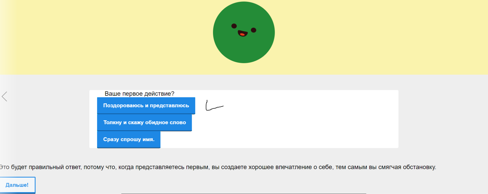

This project was bootstrapped with [Create React App](https://github.com/facebook/create-react-app).

## Available Scripts

In the project directory, you can run:

### `npm start`

Runs the app in the development mode. 
Open [http://localhost:3000](http://localhost:3000) to view it in the browser.

The page will reload if you make edits. 
You will also see any lint errors in the console.

### Описание Проекта
# Superliminial
Проект был направлен на задание от UNICEF
Развитие soft-skill у детей с особыми потребяностями.
#Description:

И так прежде всего, soft skills - это, то что мы накапливаем при коммуникации с людьми. Однако у детей с особыми потребностями, в большинстве случаев не удается в большей степени находиться среди социума. Поэтому раскачивать свои софт-скиллы они будут дополнять
на нашей веб-платформе.

Данный проект создан с целью обучить детей softskills которому не учат в школе. Приводя в пример
реальные случаи из жизни. Такие как знакомство с девушкой, собеседование на работу. Ребенку придется
выбирать наилучший вариант из предложенных чтобы успешно закончить уровень. Таким образом у него сложится картина в голове
как делать мы не советуем, и как предлагаем поступить в той или иной ситуации.

На данный момент готов прототип(пример смотрите ниже)

#Usage:
И так на мейн странице дисклеймер и уровни сложности:

После выбора сложности появляется абзац с обьяснениями.

После того, как пользователь выберет ответ, будет появлено обьяснение, почему ответ правильный или нет.

И после выбора правильного, будет появляться кнопка на следующий вопрос.

В зависимости от сложности, будет меняться количество вопросов.
Также для большего human-computer interaction будут разработаны более responsive animated elements.
Для удобства, мы решили использовать js библиотеку React.
Сверху мы уже привели, пример как можно запустить проект у себя на машине.

#Contacts:
Команда наЛавэшке, проект superliminial.
Участники:
Yernar Abilbay, Orazalinov Askhat, Yerkinbay Zhanbolat.
eabilbay@gmail.com
+7 747 981 9279
